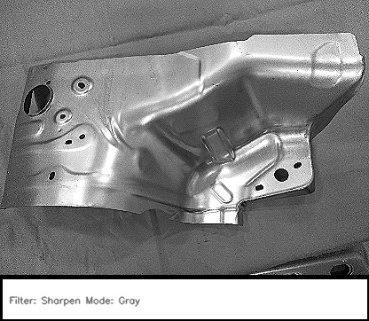

# Machine part defect detection application
:star2: *Live Demo available at http://kapilve.pythonanywhere.com/* 
Classification of a specific automotive part called **Fender Apron** (shown below) as defective and non-defective using Transfer Learning with f-1 score of 1.00  
#### Contents
* `functions.py` contains functions for preprocessing of images and making classes 
* `Machine defect detection .ipynb` is for code walk-through  
* `routes.py` is the Flask api file
* `Results` folder contain processed images with different kernels of the machine part for manual defect detection, it also contains a document about the approach followed.
* `templates` contain `index.html`, the frontend of the application 
* `MobileNet_model_keras.json` & `MobileNet_model_wieghts.h5` are saved model and its weights respectively, which are deployed in our application
#### Sample processed image of Fender Apron

### Dataset
The data is already labelled having a total of 250 images with 139 images as healthy machine parts and rest 111 as defective parts. Images given in the dataset were captured from different angles and scales. Training and Test datasets were prepared by randomly selecting a total of 25 images (i.e 10%) in which 10 were defective and 15 were healthy parts. Training/validation split used is 90/10. 
[Dataset Link](https://drive.google.com/file/d/1k57jP_oy4c9VDZmlgqCvfErzVTzPeA_M/view?usp=sharing)
> You will have to segregate them into test and train datasets yourself. To follow the notebook, you should know that I have put these random 25 test images in a new "Test" folder and renamed them as 1.jpg, 2.jpg ..... 25.jpg and put the rest other into "Train" folder with two separate "Train\Defective" and "Train\Healthy" sub-directories.
